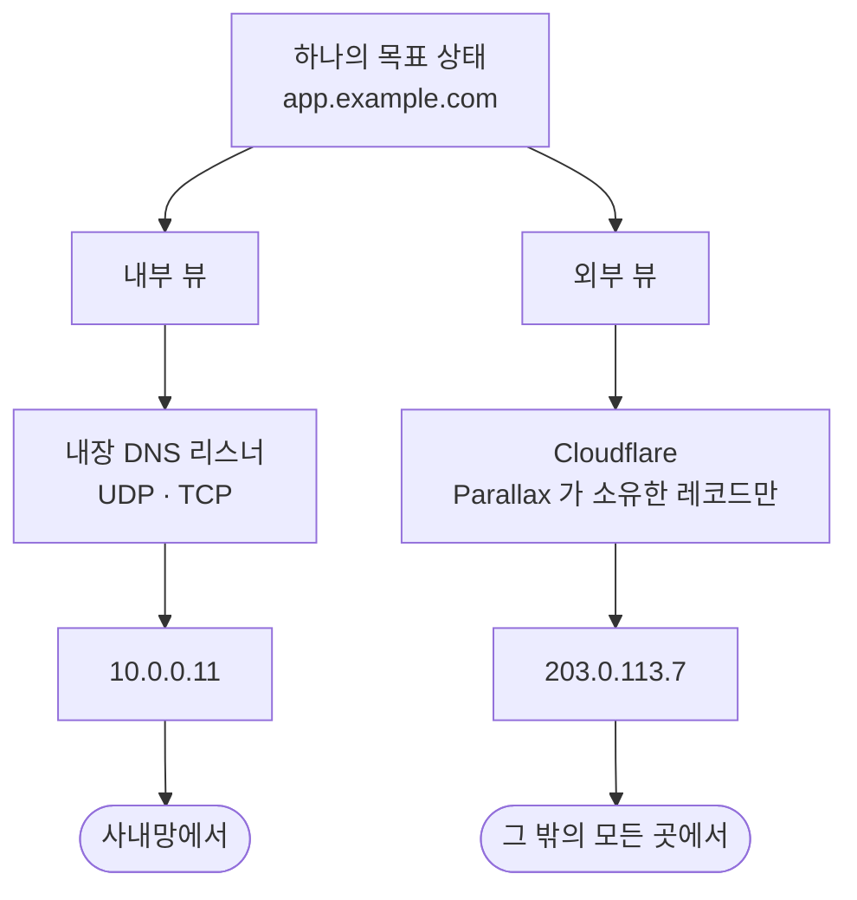
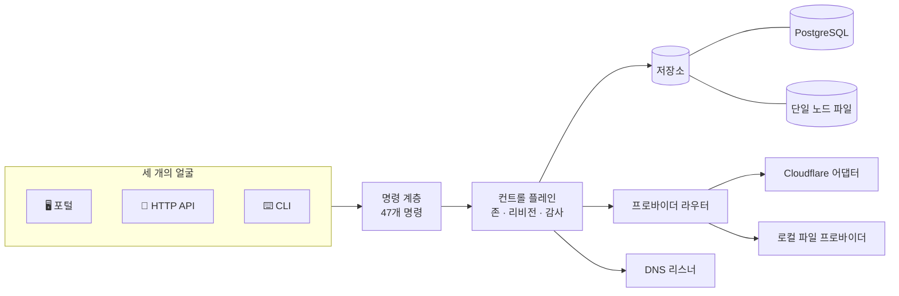
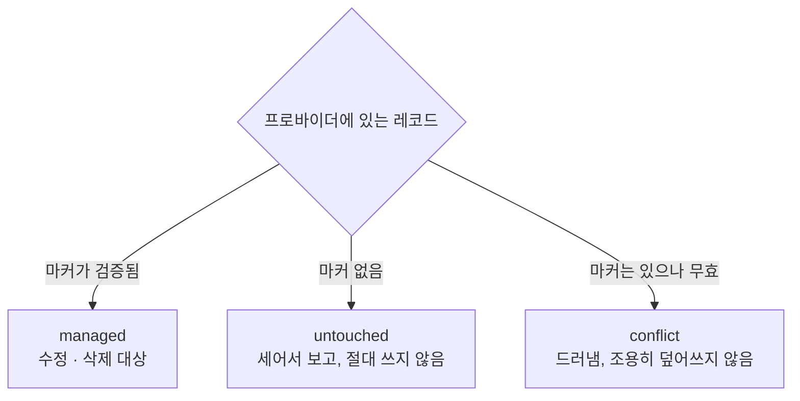

<div align="center">

<pre>
██████╗  █████╗ ██████╗  █████╗ ██╗     ██╗      █████╗ ██╗  ██╗
██╔══██╗██╔══██╗██╔══██╗██╔══██╗██║     ██║     ██╔══██╗╚██╗██╔╝
██████╔╝███████║██████╔╝███████║██║     ██║     ███████║ ╚███╔╝
██╔═══╝ ██╔══██║██╔══██╗██╔══██║██║     ██║     ██╔══██║ ██╔██╗
██║     ██║  ██║██║  ██║██║  ██║███████╗███████╗██║  ██║██╔╝ ██╗
╚═╝     ╚═╝  ╚═╝╚═╝  ╚═╝╚═╝  ╚═╝╚══════╝╚══════╝╚═╝  ╚═╝╚═╝  ╚═╝
</pre>

### 하나의 이름, 두 개의 답.

**split-horizon DNS 컨트롤 플레인이자 운영 포털.**

내부 DNS와 외부 프로바이더 DNS의 목표 상태를 한곳에 두고, 바뀌기 전에 미리
보여 주며, 자기가 소유한 레코드에만 적용합니다.

[](https://github.com/henryj-dev/parallax/actions/workflows/check.yml)
[](https://github.com/henryj-dev/parallax/actions/workflows/scripts.yml)
[](https://github.com/henryj-dev/parallax/actions/workflows/docker.yml)
[](https://github.com/henryj-dev/parallax/actions/workflows/codeql.yml)
[](https://github.com/henryj-dev/parallax/actions/workflows/dependency-review.yml)

[](LICENSE)
[](package.json)
[](tsconfig.json)
[](#-http-api)

[English](README.md) · 한국어

</div>

---

## 문제를 그림 하나로

같은 이름이 누가 묻느냐에 따라 다른 것을 가리켜야 합니다. 그걸 두 시스템에
나눠 두면, 맞게 유지하는 일도 두 번 해야 합니다.



Parallax는 목표 상태를 **하나만** 두고, 그것을 **두 뷰**로 투영한 뒤, 각 뷰를
실제 상태와 맞춥니다 — 계획을 먼저 보여 준 다음에.

---

## ✨ 무엇을 해 주는가

<table>
<tr>
<td width="50%" valign="top">

### 🎯 하나의 상태, 두 개의 뷰
레코드는 한 번만 존재합니다. `internal`과 `external`은 그것의 투영이고, 모든
프로바이더 대상은 `<zone>/<view>`로 지정됩니다.

</td>
<td width="50%" valign="top">

### 🛡️ 자기 것만 건드림
발행하는 모든 레코드에 **HMAC 서명된 소유권 마커**가 붙습니다. 자기가 쓰지
않은 레코드는 세어서 보고할 뿐, 손대지 않습니다.

</td>
</tr>
<tr>
<td valign="top">

### 👁️ 적용 전에 미리보기
`preview`가 계획을 만듭니다 — 생성·수정·삭제·충돌, 그리고 **건드리지 않을**
레코드의 수까지. 「할 일이 없다」와 「거기에 아무것도 없다」를 결코 혼동할 수
없게 하기 위해서입니다.

</td>
<td valign="top">

### 📡 DNS를 직접 응답
내부 뷰를 UDP와 TCP로 직접 응답하는 권한 리스너입니다. EDNS(0), DNS 쿠키,
AXFR(기본 거부), 아웃바운드 NOTIFY, 허용 목록 기반 포워딩, 클라이언트별
레이트 리밋을 갖췄습니다.

</td>
</tr>
<tr>
<td valign="top">

### ⏪ 모든 변경이 리비전
번호가 매겨진 리비전, 스냅샷 복원, 그리고 각 리비전이 레코드를 몇 개
더하고 빼고 바꿨는지까지 보고하는 10종 감사 기록.

</td>
<td valign="top">

### 🤝 빼앗지 않고 인수
`zone adopt`는 프로바이더에 이미 있는 것을 *설명할* 뿐입니다. 넘겨받는 것은
별도의 명시적 결정입니다.

</td>
</tr>
<tr>
<td valign="top">

### 🔐 역할·토큰·SSO
`viewer` · `editor` · `admin`. 발급형 액세스 토큰, 또는 프로토콜에 직접
맞춰 구현한 OpenID Connect 로그인.

</td>
<td valign="top">

### 🧭 하나의 머리, 세 개의 얼굴
포털·HTTP API·CLI가 **같은 명령 계층**을 호출합니다 — 그래서 서로 갈라질 수가
없습니다.

</td>
</tr>
</table>

---

## 🚀 빠른 시작

```bash
git clone https://github.com/henryj-dev/parallax
cd parallax
corepack enable
pnpm install --frozen-lockfile
```

**실행합니다.** 아무것도 설정하지 않으면 루프백에 바인드하고 상태를 파일에
둡니다 — 데이터베이스도, 토큰도, 준비 과정도 필요 없습니다:

```bash
pnpm dev                       # http://127.0.0.1:3000
```

**또는 명령줄로 다룹니다.** CLI는 저장소에 직접 닿습니다:

```bash
pnpm cli zone create --zone example.com
pnpm cli record set --zone example.com --view internal \
                    --id app --name app --type A --content 10.0.0.11 --ttl 300
pnpm cli record set --zone example.com --view external \
                    --id app --name app --type A --content 203.0.113.7 --ttl 300

pnpm cli preview --zone example.com     # 무엇이 바뀌는지
pnpm cli apply   --zone example.com     # 반영
pnpm cli status  --zone example.com     # 각 뷰가 어디까지 적용됐는지
```

> [!IMPORTANT]
> Parallax는 **액세스 토큰 없이 루프백이 아닌 주소로는 기동을 거부합니다.**
> 루프백 세션에서 토큰을 발급하거나 `PARALLAX_AUTH_TOKENS`를 설정하십시오.
> 경고가 아니라 기동 검사입니다.

---

## 🏗️ 어떻게 맞물리는가



들어가는 길은 명령 계층뿐입니다. HTTP API는 그 위의 얇은 사상이고 — OpenAPI
문서의 각 오퍼레이션이 자기가 닿는 명령의 이름을 답니다 — CLI는 전권으로
동작합니다. 그 박스의 셸을 쥐었다는 것이 곧 컨트롤 플레인 접근이기 때문입니다.

<details>
<summary><b>소스 트리</b></summary>

| 디렉터리 | 무엇이 있는가 |
|---|---|
| `src/domain/` | 레코드 타입, 검증, 조정 계획 수립, 존 파일 |
| `src/application/` | 컨트롤 플레인, 설정, 액세스 토큰, 자격 증명, fallback 도메인 |
| `src/adapters/` | Cloudflare, 소유권 마커, 프로바이더 라우터 |
| `src/dns/` | 와이어 포맷, RDATA, 쿠키, 권한 리스너, 스냅샷 |
| `src/http/` | API, 신원 라우트, OpenAPI 생성, readiness, 포털 자산 |
| `src/infrastructure/` | PostgreSQL, 파일 상태, 원자적 쓰기, 마이그레이션 |
| `src/security/` | 인가, OIDC, 세션 토큰, 암호화된 자격 증명 저장소 |
| `src/observability/` | Prometheus 메트릭과 시그널 |
| `public/` | 포털 — 바닐라 JS, 번들러 없음 |
| `cmd/parallax/` | 명령줄 진입점 |

</details>

---

## 🛡️ 소유권 모델

Parallax가 사람·Terraform·인증서 봇과 한 존을 나눠 쓰면서도 서로 밟지 않게
해 주는 부분입니다.

발행하는 모든 레코드는 프로바이더의 자유 텍스트 필드에 마커를 답니다 —
Cloudflare의 레코드 코멘트, 존 파일의 후행 코멘트:

```
parallax-managed:v3:<record-id>:<hmac-signature>
```



서명은 레코드 id뿐 아니라 **대상**까지 덮으므로, 마커를 다른 존에 복사하면
거기서는 검증되지 않습니다. 마커가 대상 자체를 담지 *않는* 것은 의도적입니다.
Cloudflare 코멘트는 100자로 제한되는데, 호출자가 이미 아는 값에 그 예산을
쓰다가 이름이 긴 존에서는 모든 쓰기가 실패한 적이 있습니다.

> [!NOTE]
> `PARALLAX_OWNERSHIP_SECRET`을 교체하면 이미 발행된 모든 레코드가 고아가
> 됩니다 — 검증되지 않게 되어 *untouched*로 분류됩니다.

---

## 🖥️ 포털

같은 프로세스가 **한국어와 영어로** 서빙합니다. 빌드 단계는 없습니다.

- **Horizon 렌즈** — 레코드 하나, 두 개의 답을 나란히
- **존 작업 공간** — 레코드, 뷰별 동기화 상태, 리비전 진행
- **적용 계획 대화상자** — 계획을 검토하고 거기서 바로 적용
- **리비전 이력** — 스냅샷을 훑고 하나를 복원
- **자격 증명 설정** — 프로필, 존 바인딩, 리졸버 오버라이드, 토큰
- **로그인** — 액세스 토큰 또는 신원 공급자

---

## ⌨️ CLI

47개 명령. 어느 것에든 `--json`을 붙이면 기계가 읽는 출력이 나오고,
`parallax help <command>`로 옵션을 봅니다.

<details open>
<summary><b>존과 레코드</b></summary>

| 명령 | |
|---|---|
| `zone list` · `zone get` · `zone create` · `zone delete` | 기본 |
| `zone replace` | 존의 목표 상태 전체를 교체 |
| `zone adopt` | 프로바이더에 이미 있는 것을 넘겨받지 않고 설명 |
| `zone export` · `zone import` | 뷰 단위 presentation-format 존 파일 |
| `record list` · `get` · `set` · `create` · `patch` · `delete` | 레코드 하나씩 |
| `record batch` | 삭제·패치·put·post를 **하나의 리비전**으로 |

</details>

<details>
<summary><b>조정</b></summary>

| 명령 | |
|---|---|
| `preview` | 목표와 실제를 비교하고 아무것도 바꾸지 않음 |
| `apply` | 한 존의 프로바이더를 맞춤 |
| `apply pending` | 대기 중인 모든 존에 적용, `--retryFailed`로 실패분 재시도 |
| `status` | 각 뷰가 어디까지 적용됐는지 |

</details>

<details>
<summary><b>이력</b></summary>

| 명령 | |
|---|---|
| `history` | 감사 기록, 최신 순 |
| `revision list` · `revision get` | 저장된 스냅샷 |
| `revision restore` | 스냅샷을 **새 리비전으로** 복원 |

</details>

<details>
<summary><b>자격 증명과 접근</b></summary>

| 명령 | |
|---|---|
| `credential profile list` · `get` · `set` · `delete` · `test` | 재사용 가능한 계정 자격 증명 |
| `credential zone list` · `get` · `set` · `delete` · `test` | apex 도메인을 프로필·존 id에 바인딩 |
| `token list` · `token issue` · `token revoke` | 액세스 토큰 — 발급된 토큰은 딱 한 번만 반환됨 |
| `settings get` · `settings set` | 저장된 운영 설정 |

</details>

<details>
<summary><b>클라이언트 측 리졸버 오버라이드</b></summary>

Cloudflare의 로컬 도메인 fallback 목록을, 프로필이 이미 쥔 자격 증명으로
다룹니다 — 두 번째 토큰을 입력하는 사람은 없습니다.

| 명령 | |
|---|---|
| `fallback list` | 오버라이드 목록 |
| `fallback coverage` | 여기 있는 모든 존에 대해: 덮이는가, 아니라면 왜 아닌가 |
| `fallback preview` · `fallback sync` | 이 프로필의 존들과 맞추면 무엇이 바뀌는지 보고, 맞춤 |
| `fallback set` · `fallback delete` | 접미사 하나씩 |

</details>

<details>
<summary><b>운영</b></summary>

| 명령 | |
|---|---|
| `config check` | 이 프로세스의 기동을 막을 것을 **기동하지 않고** 보고 |
| `migrate` | 데이터베이스 스키마 적용, 재실행해도 안전 |
| `openapi` | 이 컨트롤 플레인 자신의 OpenAPI 기술을 출력 |

</details>

---

## 🔌 HTTP API

**40개 경로.** 프로세스가 자기 명령 표에서 생성하는 OpenAPI 3.1 문서가
기술합니다 — 그래서 기술과 동작이 갈라질 수 없습니다.

```
GET /api/v1/openapi.json
```

<details>
<summary><b>전체 라우트</b></summary>

| | |
|---|---|
| **존** | `GET POST /zones` · `GET PUT DELETE /zones/{zone}` |
| **레코드** | `GET /zones/{zone}/records`<br/>`GET POST /zones/{zone}/views/{view}/records`<br/>`GET PUT PATCH DELETE …/records/{id}`<br/>`POST …/records/batch` |
| **조정** | `GET POST /zones/{zone}/preview` · `POST /zones/{zone}/apply` · `POST /apply` · `POST /zones/{zone}/adopt` |
| **상태** | `GET /status` · `GET /zones/{zone}/status` · `GET /zones/{zone}/export` · `POST /zones/{zone}/import` |
| **이력** | `GET /history` · `GET /zones/{zone}/history` · `GET /zones/{zone}/audit`<br/>`GET /zones/{zone}/revisions` · `GET …/revisions/{revision}` · `POST …/restore` |
| **관리** | `GET PUT /settings` · `GET POST /tokens` · `DELETE /tokens/{id}` |
| **자격 증명** | `GET /credentials/profiles` · `GET PUT DELETE /credentials/profiles/{name}` · `POST …/test`<br/>`GET /credentials/cloudflare` · `GET PUT DELETE /credentials/cloudflare/{zone}` · `POST …/test` |
| **Fallback** | `GET /fallback/{profile}` · `…/coverage` · `…/preview` · `POST …/sync` · `PUT DELETE …/domains/{suffix}` |
| **메타** | `POST /cli` · `GET /openapi.json` · `POST DELETE /session` |
| **프로브** | `GET /health/live` · `GET /health/ready` · `GET /metrics` |

</details>

**역할.** `viewer`는 읽고, `editor`는 레코드를 바꾸고, `admin`은 전부 합니다 —
자격 증명·설정·토큰은 **읽기까지 admin 전용**입니다. 각각이 누가 무엇을 할 수
있는지를 드러내거나 바꾸기 때문입니다.

**낙관적 동시성.** 변경 오퍼레이션은 `expectedRevision`을 받고, 존이 그 사이
움직였으면 거부합니다.

---

## ⚙️ 설정

루프백에서 파일 상태로 띄우는 데는 아래 중 아무것도 필요하지 않습니다.

<details open>
<summary><b>기본</b></summary>

| 변수 | |
|---|---|
| `HOST` · `PORT` | API와 포털이 바인드하는 곳. 기본값 `127.0.0.1:3000` |
| `DATABASE_URL` | PostgreSQL 사용. 없으면 단일 노드 파일 |
| `PARALLAX_STATE_FILE` · `PARALLAX_CONFIG_FILE` · `PARALLAX_PROVIDER_STATE_FILE` | 그 파일들의 위치 |
| `PARALLAX_AUTH_TOKENS` | 비상용 토큰(JSON). 평소 토큰은 포털에서 발급 |
| `PARALLAX_OWNERSHIP_SECRET` | 소유권 마커 서명 |
| `PARALLAX_CREDENTIAL_MASTER_KEY` | 저장된 프로바이더 자격 증명 암호화(AES-256-GCM) |

</details>

<details>
<summary><b>TLS와 신원</b></summary>

| 변수 | |
|---|---|
| `PARALLAX_TLS_CERT_FILE` · `PARALLAX_TLS_KEY_FILE` | 프록시 뒤가 아니라 프로세스가 직접 TLS 종단. 변경되면 재적재 |
| `PARALLAX_HTTP_REDIRECT_PORT` | 평문 HTTP를 TLS origin으로 리다이렉트 |
| `PARALLAX_OIDC_ISSUER` · `_CLIENT_ID` · `_CLIENT_SECRET` · `_REDIRECT_URI` · `_SCOPES` | OpenID Connect 로그인. 엔드포인트는 발급자의 `/.well-known/openid-configuration` 에서 읽는다. 그것을 내놓지 않는 프로바이더는 `{issuer}/oidc/…` 로 되돌아가고 로그인 때 그렇게 말한다 |
| `PARALLAX_OIDC_ROLE_CLAIM` | 여기서의 역할(`admin`·`editor`·`viewer`)을 담은 userinfo 클레임. 기본값 `entitlements` — 표준 클레임이 없으므로 다르게 부르는 디렉터리는 이름을 대야 한다 |
| `PARALLAX_OIDC_SESSION_SECRET` · `_SESSION_SECONDS` | 세션 서명과 수명 |
| `PARALLAX_PORTAL_SIGN_IN` | 로그인하지 않은 방문자에게 포털이 무엇을 제시할지 |

</details>

<details>
<summary><b>DNS 리스너</b></summary>

`PARALLAX_DNS_PORT`를 설정하는 것이 리스너를 켜는 스위치입니다. 나머지는 모두
기본값이 있고, 그 기본값은 조심스러운 쪽입니다.

| 변수 | |
|---|---|
| `PARALLAX_DNS_PORT` | **리스너를 켭니다.** 설정하지 않으면 포트를 열지 않음 |
| `PARALLAX_DNS_HOST` | 기본값은 `HOST`, 그다음 `127.0.0.1` |
| `PARALLAX_DNS_FORWARD_TO` | 모든 존 밖 이름의 상위. 비우면 `REFUSED`로 답함 |
| `PARALLAX_DNS_FORWARD_ALLOW` | 재귀를 허용할 클라이언트 CIDR. 기본은 루프백이고, 리스너가 루프백이 아니면서 포워딩이 켜져 있으면 **필수** |
| `PARALLAX_DNS_TRANSFER_ALLOW` | `AXFR`를 허용할 클라이언트 CIDR. **기본은 전부 거부** |
| `PARALLAX_DNS_NOTIFY_TO` | 서빙 중인 존의 serial이 오를 때 NOTIFY를 받을 호스트 |
| `PARALLAX_DNS_SOA_PRIMARY` · `_SOA_MAILBOX` | SOA 필드 |
| `PARALLAX_DNS_REQUIRE_COOKIE` | RFC 7873 DNS 쿠키 요구 |
| `PARALLAX_DNS_RATE_LIMIT_PER_SECOND` · `_BURST` · `_MAX_CLIENTS` | 클라이언트별 레이트 리밋 |
| `PARALLAX_DNS_MAX_TCP_CONNECTIONS` · `_MAX_CONCURRENT_FORWARDS` · `_FORWARD_TIMEOUT_MS` | 자원 상한 |

</details>

<details>
<summary><b>저장된 설정</b> — 환경변수가 아니라 저장소에 있습니다</summary>

| 설정 | |
|---|---|
| `allowLocalProvider` | 대상에 실제 프로바이더가 없을 때 로컬 파일로 발행 |
| `publicOrigin` | 브라우저가 포털에 닿는 절대 origin. 비우면 요청마다 유도 |
| `trustForwardedHeaders` | `X-Forwarded-Proto` / `X-Forwarded-Host` 신뢰 |
| `revisionRetention` | 존마다 보관할 최신 스냅샷 수. `0`이면 전부 보관 |
| `auditRetentionDays` | 존마다 보관할 감사 이력 일수. `0`이면 전부 보관 |
| `fallbackResolver` | 클라이언트 측 리졸버 오버라이드가 가리킬 주소 |

</details>

---

## 📊 관측

| 엔드포인트 | |
|---|---|
| `GET /health/live` | 프로세스가 살아 있음 |
| `GET /health/ready` | 올바르게 답할 수 있음 — 목표 상태가 낡으면 fail closed |
| `GET /metrics` | Prometheus 텍스트 포맷 |

게이지는 선언 시점에 레지스트리로 복사하지 않고, 값을 이미 쥔 쪽에서 스크레이프
시점에 읽습니다. 복사본이 낡는 경로를 만들지 않기 위해서입니다.

```
parallax_ready                                  readiness 를 통과할 상태면 1
parallax_desired_state_age_seconds              목표 상태를 마지막으로 읽은 뒤 경과
parallax_desired_state_max_age_seconds          readiness 가 실패하기까지 허용되는 낡음
parallax_dns_served_zones                       리스너가 답하는 존의 수
parallax_access_token_cache_ready               캐시된 토큰으로 인증할 수 있으면 1
parallax_access_token_cache_age_seconds         그 캐시를 마지막으로 갱신한 뒤 경과
parallax_dns_zones_skipped_total                내부 뷰를 구성할 수 없어 제외된 존
parallax_dns_unservable_records_total           와이어에 닿았으나 쓸 수 없던 저장 레코드
parallax_dns_unanswerable_replies_total         답할 수 없던 질의
parallax_dns_notify_failures_total              실패한 NOTIFY 발송
parallax_refresh_failures_total                 서브시스템별 백그라운드 갱신 실패
parallax_tls_certificate_reload_failures_total  실패한 인증서 재적재
```

---

## 🐳 배포

```bash
docker build -t parallax .
docker run --rm -p 3000:3000 \
  -e HOST=0.0.0.0 \
  -e PARALLAX_AUTH_TOKENS='[…]' \
  parallax
```

이미지는 API·포털·CLI를 한 프로세스로, 권한 없는 uid `10001`로 돌립니다.
`migrations/`는 의도적으로 root 소유이며 그 uid가 쓸 수 없습니다. 서비스가
털렸을 때 나중의 특권 `parallax migrate`를 노린 SQL을 심을 수 없게 하기
위해서입니다.

| 저장소 | 언제 |
|---|---|
| **PostgreSQL** | `DATABASE_URL`이 설정됐을 때. 7개 테이블, `parallax migrate`가 적용 |
| **파일** | 그 밖의 경우. 원자적 쓰기, `0700` 디렉터리 안의 `0600` 파일 |

### 이 릴리스가 스키마를 바꾸는가?

파드를 하나씩 교체하는 배포는 몇 초 동안 두 버전을 동시에 돌립니다. 그것이
안전한지는 질문 하나로 정해지고, 그 답은 한 줄입니다:

```bash
git diff --name-only <배포된>..<새것> -- migrations/ src/infrastructure/migrations.ts
```

출력이 비면 이 릴리스는 스키마를 바꾸지 않으므로 두 버전이 겹쳐도 됩니다.
무언가 나열되면 겹치면 안 됩니다.

> [!WARNING]
> 저 두 경로가 답 **전체**이고, 그게 위험한 지점입니다. `CREATE TABLE`이 그
> 밖으로 옮겨 가면 이 명령은 계속 아무것도 내놓지 않고 — 아무것도 없음은
> 「겹쳐도 안전」으로 읽힙니다. 깨지는 게 아니라, 하필 중요한 그 릴리스에서
> 거짓말을 시작합니다.
>
> 그래서 믿는 대신 강제합니다. `test/infrastructure/schema-surface.test.ts`가
> `src/`와 `cmd/`를 훑어 감시 경로 밖의 DDL을 찾고, 그 경로를 여기 반복해 적는
> 대신 **위 명령에서 읽어 냅니다** — 같은 사실의 세 번째 사본이 바로 이 부류의
> 실패를 만드는 재료이기 때문입니다. 또한 `README.md`와 `README.ko.md`가 같은
> 경로를 대는지도 검사합니다. 낡은 번역본은 곧 낡은 검사이기 때문입니다. CI는
> 이것을 별도 잡으로, 아무것도 설치하지 않은 맨 체크아웃에서 돌립니다 —
> 배포가 실제로 그렇게 돌리기 때문입니다.

---

## 🧪 개발

```bash
pnpm check          # 타입 검사
pnpm run check:portal
pnpm build
pnpm test           # node --test
```

CI에서 다섯 워크플로가 돌고, 각각 다른 질문에 답하므로 빨간 결과가 스스로
원인을 말합니다: `check`(타입·빌드·테스트, Node 24와 26), `scripts`(훅 스위트와
shellcheck), `docker`(이미지가 빌드되고 권한 없이 도는지), `codeql`,
`dependency-review`.

`verify:*` 스크립트는 실제 인프라를 대상으로 하며 CI에서 **돌지 않습니다**:

```bash
pnpm verify:postgres    pnpm verify:dns
pnpm verify:proxy       pnpm verify:cloudflare   # ⚠️ 실제 존에 씁니다
```

풀 리퀘스트를 열기 전에 [CONTRIBUTING.md](CONTRIBUTING.md)를, 취약점을 신고하기
전에 [SECURITY.md](.github/SECURITY.md)를 보십시오 — 신고는 이슈가 아니라
비공개로 합니다.

---

## 📇 레코드 타입

23종. presentation format의 RDATA로 검증합니다 — 존 파일이 타입 뒤에 적는 바로
그 텍스트입니다:

```
A · AAAA · CAA · CERT · CNAME · DNAME · DNSKEY · DS · HINFO · HTTPS · LOC · MX
NAPTR · NS · OPENPGPKEY · PTR · SMIMEA · SRV · SSHFP · SVCB · TLSA · TXT · URI
```

`SOA`는 제외했고, 서명자가 자기가 서명하는 존에 대해 만들어 내는 DNSSEC
레코드 — `RRSIG`, `NSEC`, `NSEC3` — 도 제외했습니다. 모든 프로바이더가 그것들을
스스로 만들고, 우리 것을 발행하면 묻지도 않은 답을 덮어쓰게 됩니다. `DS`와
`DNSKEY`는 **넣었습니다**. `DS`는 부모에 놓여 서명된 자식으로 위임하는 것이고,
그것은 남의 존에 대한 운영자의 결정이기 때문입니다.

> [!WARNING]
> **외부** 뷰에 비공개 주소를 발행하려면 해당 레코드에 `acknowledgeNonGlobalIp`를
> 설정해야 합니다. 그러지 않으면 거부됩니다 — `10.0.0.11`을 공개 인터넷에 올리는
> 것은 대개 실수이고, 실수가 아닐 때는 누군가 일부러 한 것이어야 합니다.

---

<div align="center">

**Apache-2.0** · [LICENSE](LICENSE)

</div>
