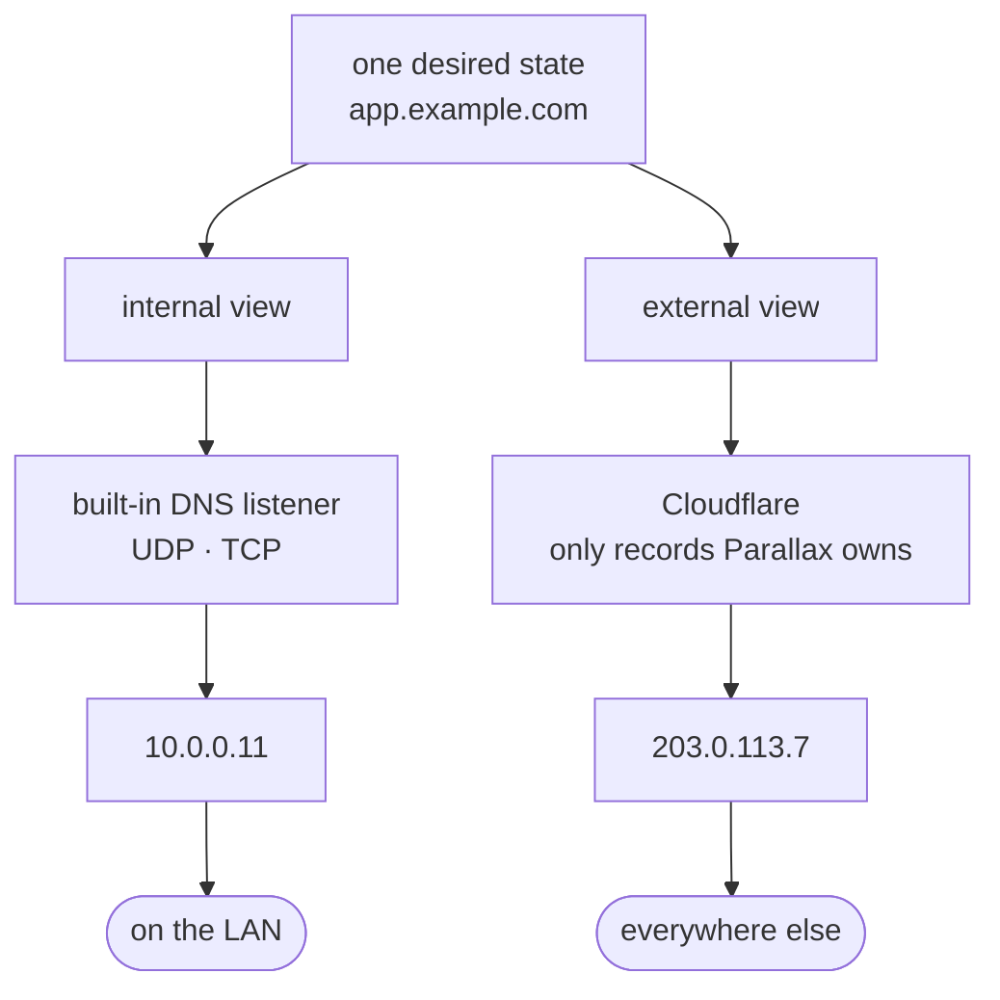
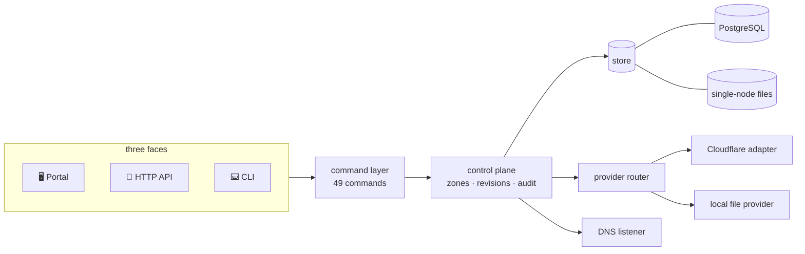
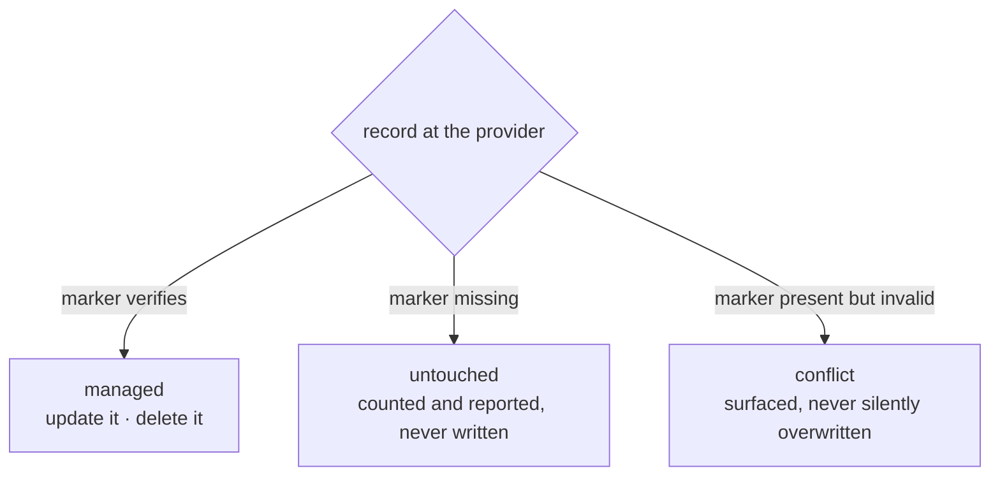

<div align="center">

<h1>parallax</h1>

### **A split-horizon DNS control plane and operations portal.**

One desired state for internal DNS and external provider DNS — previewed before
it moves, and applied only to the records it owns.

<br/>

[](https://github.com/henryj-dev/parallax/actions/workflows/check.yml)
[](https://github.com/henryj-dev/parallax/actions/workflows/codeql.yml)

<br/>


[](#http-api)
[](LICENSE)

<br/>

> *A parallax is the shift in a thing's apparent position when you look at it from
> somewhere else — one object, two answers, both of them correct.*

English · [한국어](README.ko.md)

</div>

---

## Contents

- [The problem](#the-problem)
- [What it does](#what-it-does)
- [Quick start](#quick-start)
- [How it fits together](#how-it-fits-together)
- [The ownership model](#the-ownership-model)
- [Configuration](#configuration)
- [Command line](#command-line)
- [HTTP API](#http-api)
- [Record types](#record-types)
- [The portal](#the-portal)
- [Operations](#operations)
- [Development](#development)
- [Status & limitations](#status--limitations)
- [License](#license)

---

## The problem

The same name has to mean two different things depending on who is asking.
Keeping that in two systems means keeping it right twice.



Parallax holds **one** desired state, projects it into **two** views, and
reconciles each view with whatever is actually there — after showing you the
plan.

---

## What it does

<table>
<tr>
<td width="50%" valign="top">

### 🎯 One state, two views
Every record lives once. `internal` and `external` are projections of it, and
every provider target is addressed as `<zone>/<view>`.

</td>
<td width="50%" valign="top">

### 🛡️ Touches only what it owns
Each published record carries an **HMAC-signed ownership marker**. Records it
did not write are counted, reported, and left alone.

</td>
</tr>
<tr>
<td valign="top">

### 👁️ Preview before apply
`preview` builds a plan — creates, updates, deletes, conflicts — and an
explicit count of the records it will **not** touch, so "nothing to do" can
never be mistaken for "there is nothing there".

</td>
<td valign="top">

### 📡 Answers DNS itself
An authoritative listener for the internal view over UDP and TCP: EDNS(0), DNS
cookies, AXFR (denied by default), outbound NOTIFY, allow-listed forwarding,
and per-client rate limiting.

</td>
</tr>
<tr>
<td valign="top">

### ⏪ Every change is a revision
Numbered revisions, snapshot restore, and a ten-action audit trail that reports
how many records each revision added, removed and changed.

</td>
<td valign="top">

### 🤝 Adopt without seizing
`zone adopt` *describes* what already exists at the provider. Taking records
over is a separate, explicit decision.

</td>
</tr>
<tr>
<td valign="top">

### 🔐 Roles, tokens, and SSO
`viewer` · `editor` · `admin`. Issued access tokens, or OpenID Connect sign-in
written directly against the protocol.

</td>
<td valign="top">

### 🧭 Same brain, three faces
The portal, the HTTP API and the CLI all invoke **the same command layer** — so
they cannot drift apart.

</td>
</tr>
</table>

---

## Quick start

```bash
git clone https://github.com/henryj-dev/parallax
cd parallax
corepack enable
pnpm install --frozen-lockfile
```

**Run it.** With nothing configured it binds loopback and keeps state in files —
no database, no token, no ceremony:

```bash
pnpm dev                       # http://127.0.0.1:3000
```

**Or drive it from the command line.** The CLI reaches the store directly. A
record's body arrives as one JSON value, the same shape the HTTP API takes:

```bash
pnpm cli settings set --values '{"allowLocalProvider":true}'   # publish to a file, for now

pnpm cli zone create --zone example.com
pnpm cli record set --zone example.com --view internal --id app \
        --record '{"name":"app","type":"A","content":"10.0.0.11","ttl":300}'
pnpm cli record set --zone example.com --view external --id app \
        --record '{"name":"app","type":"A","content":"203.0.113.7","ttl":300,"acknowledgeNonGlobalIp":true}'

pnpm cli preview --zone example.com     # what would change
pnpm cli apply   --zone example.com     # make it so
pnpm cli status  --zone example.com     # how far each view got
```

Two of those lines are the guards working rather than getting in the way.
`allowLocalProvider` is off by default, so without it `apply` reports each view
as `failed` with `no provider is configured` — there is nothing to publish to
until a Cloudflare credential exists, and a file stands in meanwhile.
`203.0.113.7` is a documentation address, which is not globally routable, so the
external view refuses it until somebody says the exposure was reviewed. Both
refusals are the point; a real deployment reaches a real provider with a real
address and needs neither line.

> [!IMPORTANT]
> Parallax **refuses to start on a non-loopback address with no access token**.
> Issue one from a loopback session, or set `PARALLAX_AUTH_TOKENS`. That is a
> startup check, not a warning.

---

## How it fits together



The command layer is the only way in. The HTTP API is a thin mapping onto it —
each operation in the OpenAPI document names the command it reaches — and the
CLI acts with full rights because a shell on the box *is* control-plane access.

<details>
<summary><b>The source tree</b></summary>

| Directory | What lives there |
|---|---|
| `src/domain/` | Record types, validation, the reconciliation planner, zone files |
| `src/application/` | Control plane, settings, access tokens, credentials, fallback domains |
| `src/adapters/` | Cloudflare, the ownership marker, the provider router |
| `src/dns/` | Wire format, RDATA, cookies, the authoritative listener, snapshots |
| `src/http/` | API, identity routes, OpenAPI generation, readiness, portal assets |
| `src/infrastructure/` | PostgreSQL, file state, atomic writes, migrations |
| `src/security/` | Authorization, OIDC, session tokens, encrypted credential store |
| `src/observability/` | Prometheus metrics and signals |
| `public/` | The portal — vanilla JS, no bundler |
| `cmd/parallax/` | The command-line entry point |

</details>

---

## The ownership model

This is the part that lets Parallax share a zone with a human, a Terraform run,
and a certificate bot without any of them stepping on the others.

Every record Parallax publishes carries a marker in the provider's free-text
field — a Cloudflare record comment, a trailing comment in a zone file:

```text
parallax-managed:v3:<record-id>:<hmac-signature>
```



The signature covers the **target** as well as the record id, so a marker copied
to another zone stops verifying there. The marker deliberately does *not* carry
the target itself: a Cloudflare comment is capped at 100 characters, and
spending that budget on a value the caller already knows once made every write
against a long zone name fail.

> [!NOTE]
> Rotating `PARALLAX_OWNERSHIP_SECRET` orphans every record already published —
> they stop verifying and become *untouched*.

---

## Configuration

Nothing below is required to start on loopback with file state.

<details open>
<summary><b>Core</b></summary>

| Variable | |
|---|---|
| `HOST` · `PORT` | Where the API and portal bind. Defaults `127.0.0.1:3000` |
| `DATABASE_URL` | Use PostgreSQL. Absent means single-node files |
| `PARALLAX_STATE_FILE` · `PARALLAX_CONFIG_FILE` · `PARALLAX_PROVIDER_STATE_FILE` | Where those files live. The state file keeps its history beside it in `<state file>.d/` — back up the directory, not the one file |
| `PARALLAX_AUTH_TOKENS` | Break-glass tokens, as JSON. Normal tokens are issued through the portal |
| `PARALLAX_OWNERSHIP_SECRET` | Signs ownership markers |
| `PARALLAX_CREDENTIAL_MASTER_KEY` | Encrypts stored provider credentials (AES-256-GCM) |

</details>

<details>
<summary><b>TLS &amp; identity</b></summary>

| Variable | |
|---|---|
| `PARALLAX_TLS_CERT_FILE` · `PARALLAX_TLS_KEY_FILE` | End TLS in-process instead of behind a proxy. Reloaded on change |
| `PARALLAX_HTTP_REDIRECT_PORT` | Answer plain HTTP with a redirect to the TLS origin |
| `PARALLAX_OIDC_ISSUER` · `_CLIENT_ID` · `_CLIENT_SECRET` · `_REDIRECT_URI` · `_SCOPES` | OpenID Connect sign-in. The endpoints come from the issuer's `/.well-known/openid-configuration`; a provider that publishes none falls back to `{issuer}/oidc/…` and says so at sign-in |
| `PARALLAX_OIDC_ROLE_CLAIM` | Which userinfo claim grants a role here — `admin`, `editor` or `viewer`. Defaults to `entitlements`; no claim is standard, so a directory that spells it otherwise must say so |
| `PARALLAX_OIDC_SESSION_SECRET` · `_SESSION_SECONDS` | Session signing and lifetime |
| `PARALLAX_PORTAL_SIGN_IN` | What the portal offers a visitor who has not signed in |

</details>

<details>
<summary><b>The DNS listener</b></summary>

Setting `PARALLAX_DNS_PORT` is what turns it on. Everything else has a default,
and the defaults are the careful ones.

| Variable | |
|---|---|
| `PARALLAX_DNS_PORT` | **Enables the listener.** Unset leaves the port unbound |
| `PARALLAX_DNS_HOST` | Defaults to `HOST`, then to `127.0.0.1` |
| `PARALLAX_DNS_FORWARD_TO` | Upstreams for names outside every zone. Empty answers `REFUSED` |
| `PARALLAX_DNS_FORWARD_ALLOW` | Client CIDRs allowed to recurse. Defaults to loopback — and is **required** if the listener is not loopback and forwarding is on |
| `PARALLAX_DNS_TRANSFER_ALLOW` | Client CIDRs allowed `AXFR` and `IXFR`. **Defaults to deny all** |
| `PARALLAX_DNS_TSIG_KEYS` | `name:algorithm:base64secret`, comma-separated. Setting any key makes a valid TSIG signature **required** for `AXFR`; `hmac-sha256`/`hmac-sha512` only |
| `PARALLAX_DNS_NOTIFY_TO` | Hosts that get NOTIFY when a served zone's serial rises. `host`, `host:port`, or `host:port#keyname` to sign it |
| `PARALLAX_DNS_INTERNAL_UPDATE` | `host:port#keyname` — also publish the internal view into a server that speaks **RFC 2136**. A server published to keeps answering when this process stops; a listener inside it does not |
| `PARALLAX_DNS_SOA_PRIMARY` · `_SOA_MAILBOX` | SOA fields |
| `PARALLAX_DNS_REQUIRE_COOKIE` | Require RFC 7873 DNS cookies |
| `PARALLAX_DNS_RATE_LIMIT_PER_SECOND` · `_BURST` · `_MAX_CLIENTS` | Per-client rate limiting |
| `PARALLAX_DNS_MAX_TCP_CONNECTIONS` · `_MAX_CONCURRENT_FORWARDS` · `_FORWARD_TIMEOUT_MS` | Resource ceilings |

</details>

<details>
<summary><b>Stored settings</b> — in the store, not the environment</summary>

| Setting | |
|---|---|
| `allowLocalProvider` | Publish to a local file when no real provider is configured |
| `publicOrigin` | Absolute origin browsers reach the portal at; empty derives it per request |
| `trustForwardedHeaders` | Trust `X-Forwarded-Proto` / `X-Forwarded-Host` |
| `revisionRetention` | Newest snapshots kept per zone; `0` keeps every one |
| `auditRetentionDays` | Days of audit history kept per zone; `0` keeps everything |
| `fallbackResolver` | Address a client-side resolver override should point at |

</details>

---

## Command line

49 commands. Add `--json` to any of them for machine-readable output; run
`parallax help <command>` for its options.

<details open>
<summary><b>Zones &amp; records</b></summary>

| Command | |
|---|---|
| `zone list` · `zone get` · `zone create` · `zone delete` | The basics |
| `zone replace` | Replace a zone's complete desired state |
| `zone adopt` | Describe what already exists at the provider, without taking it over |
| `zone export` · `zone import` | Presentation-format zone files, per view |
| `record list` · `get` · `set` · `create` · `patch` · `delete` | One record at a time |
| `record batch` | Deletes, patches, puts and posts as a **single revision** |

</details>

<details>
<summary><b>Reconciliation</b></summary>

| Command | |
|---|---|
| `preview` | Compare desired and actual state, change nothing |
| `apply` | Reconcile one zone's providers |
| `apply pending` | Apply every pending zone; `--retryFailed` to retry failures |
| `status` | How far each view has been applied |

</details>

<details>
<summary><b>History</b></summary>

| Command | |
|---|---|
| `history` | The audit trail, newest first |
| `revision list` · `revision get` | Stored snapshots |
| `revision restore` | Restore a snapshot as a **new** revision |

</details>

<details>
<summary><b>Credentials &amp; access</b></summary>

| Command | |
|---|---|
| `credential profile list` · `get` · `set` · `delete` · `test` | Reusable account credentials |
| `credential zone list` · `get` · `set` · `delete` · `test` | Bind an apex domain to a profile and zone id |
| `token list` · `token issue` · `token revoke` | Access tokens — issued tokens are returned exactly once |
| `settings get` · `settings set` | Stored operational settings |

</details>

<details>
<summary><b>Client-side resolver overrides</b></summary>

Cloudflare's local-domain fallback list, driven by the credential the profile
already holds — nobody types a second token.

| Command | |
|---|---|
| `fallback list` | Show the overrides |
| `fallback coverage` | For every zone held here: is it covered, and why not |
| `fallback preview` · `fallback sync` | Show, then make, the overrides match this profile's zones |
| `fallback set` · `fallback delete` | One suffix at a time |

</details>

<details>
<summary><b>Operations</b></summary>

| Command | |
|---|---|
| `config check` | Report what would stop this process from starting — **without starting it** |
| `migrate` | Apply the database schema; safe to re-run |
| `backup` | Write everything this store holds as one document |
| `restore` | Load such a document into an **empty** store, from either backend |
| `openapi` | Print this control plane's own OpenAPI description |

</details>

`backup` and `restore` have no HTTP route and cannot get one: the serving
runtime is not given the repositories they use, so neither the credential
document nor a direct write to the revision history is reachable through a
port. They are also how you move between backends — the two stores implement
the same interfaces, and the document only ever speaks to those:

```bash
PARALLAX_STATE_FILE=./data/state.json parallax backup --json > parallax-backup.json
DATABASE_URL=postgres://… parallax migrate
DATABASE_URL=postgres://… parallax restore < parallax-backup.json
```

> [!WARNING]
> The document is **as sensitive as the state file**, because it is a copy of
> it: it carries the credential store's ciphertext, which is useless without
> `PARALLAX_CREDENTIAL_MASTER_KEY` and is still not something to leave where the
> state file would not be left. `restore` refuses a store that already holds
> zones or tokens — it is not a merge. Audit ids are assigned by the store, so a
> restored log is renumbered from 1; the order and the content survive.

---

## HTTP API

**40 paths**, described by an OpenAPI 3.1 document the process generates from
its own command table — so the description cannot drift from the behaviour.

```http
GET /api/v1/openapi.json
```

<details>
<summary><b>Every route</b></summary>

| | |
|---|---|
| **Zones** | `GET POST /zones` · `GET PUT DELETE /zones/{zone}` |
| **Records** | `GET /zones/{zone}/records`<br/>`GET POST /zones/{zone}/views/{view}/records`<br/>`GET PUT PATCH DELETE …/records/{id}`<br/>`POST …/records/batch` |
| **Reconcile** | `GET POST /zones/{zone}/preview` · `POST /zones/{zone}/apply` · `POST /apply` · `POST /zones/{zone}/adopt` |
| **State** | `GET /status` · `GET /zones/{zone}/status` · `GET /zones/{zone}/export` · `POST /zones/{zone}/import` |
| **History** | `GET /history` · `GET /zones/{zone}/history` · `GET /zones/{zone}/audit`<br/>`GET /zones/{zone}/revisions` · `GET …/revisions/{revision}` · `POST …/restore` |
| **Admin** | `GET PUT /settings` · `GET POST /tokens` · `DELETE /tokens/{id}` |
| **Credentials** | `GET /credentials/profiles` · `GET PUT DELETE /credentials/profiles/{name}` · `POST …/test`<br/>`GET /credentials/cloudflare` · `GET PUT DELETE /credentials/cloudflare/{zone}` · `POST …/test` |
| **Fallback** | `GET /fallback/{profile}` · `…/coverage` · `…/preview` · `POST …/sync` · `PUT DELETE …/domains/{suffix}` |
| **Meta** | `POST /cli` · `GET /openapi.json` · `POST DELETE /session` |
| **Probes** | `GET /health/live` · `GET /health/ready` · `GET /metrics` |

</details>

**Roles.** `viewer` reads. `editor` changes records. `admin` gets everything —
and credentials, settings and tokens are admin-only **including reads**, because
each one exposes or changes who can act.

**Optimistic concurrency.** Mutating operations accept an `expectedRevision` and
refuse if the zone moved on.

---

## Record types

23 types, validated by their RDATA in presentation format — the same text a zone
file puts after the type:

```text
A · AAAA · CAA · CERT · CNAME · DNAME · DNSKEY · DS · HINFO · HTTPS · LOC · MX
NAPTR · NS · OPENPGPKEY · PTR · SMIMEA · SRV · SSHFP · SVCB · TLSA · TXT · URI
```

`SOA` is excluded, and so are the DNSSEC records a signer produces for the zone
it signs — `RRSIG`, `NSEC`, `NSEC3`. Every provider generates those itself, and
publishing our own would overwrite an answer we never asked for. `DS` and
`DNSKEY` *are* here: a `DS` sits in the parent and delegates to a signed child,
which is an operator's decision about somebody else's zone.

> [!WARNING]
> Publishing a non-global address in the **external** view requires setting
> `acknowledgeNonGlobalIp` on that record. It is refused otherwise — putting
> `10.0.0.11` on the public internet is usually a mistake, and when it isn't, it
> should be one somebody made on purpose.

---

## The portal

Served from the same process, in **English and Korean**, with no build step.

- **Horizon lens** — one record, both answers, side by side
- **Zone workspace** — records, sync state per view, revision progress
- **Apply plan dialog** — review the plan, then apply from it
- **Revision history** — browse snapshots and restore one
- **Credential settings** — profiles, zone bindings, resolver overrides, tokens
- **Sign-in** — access token or your identity provider

---

## Operations

### Observability

| Endpoint | |
|---|---|
| `GET /health/live` | The process is up |
| `GET /health/ready` | It would answer correctly — fails closed on stale desired state |
| `GET /metrics` | Prometheus text format |

Gauges are read at scrape time from whoever already owns the value, rather than
copied into a registry where the copy can go stale.

```text
parallax_ready                                  1 when this process would pass readiness
parallax_desired_state_age_seconds              since the desired state was last read
parallax_desired_state_max_age_seconds          how stale that may get before readiness fails
parallax_dns_served_zones                       zones the listener answers for
parallax_access_token_cache_ready               tokens fresh enough to authenticate with
parallax_access_token_cache_age_seconds         since that cache last refreshed
parallax_dns_zones_skipped_total                zones whose internal view would not compose
parallax_dns_unservable_records_total           stored records that reached the wire and could not
parallax_dns_unanswerable_replies_total         queries that could not be answered
parallax_dns_notify_failures_total              NOTIFY sends that failed
parallax_dns_forward_failures_total             DNS forwarding failures by upstream index and reason
parallax_refresh_failures_total                 background refresh failures, by subsystem
parallax_tls_certificate_reload_failures_total  certificate reloads that failed
```

### Deployment

```bash
docker build -t parallax .
docker run --rm -p 3000:3000 \
  -e HOST=0.0.0.0 \
  -e PARALLAX_AUTH_TOKENS='[…]' \
  parallax
```

The image runs the API, the portal and the CLI from one process, as an
unprivileged uid `10001`. `migrations/` stays root-owned and unwritable by that
uid on purpose: compromising the service must not let it plant SQL for a later
privileged `parallax migrate`.

### Security assumptions at deployment

The DNS `servedByProvider` path intentionally relays provider-placeholder names
even when the client is outside `forwardAllow`. It is not a general open
resolver: the name must belong to a served zone and use that zone's configured
placeholder. Both UDP and TCP entry points still apply the per-client rate
limiter, and `maxConcurrentForwards` (default `256`) bounds in-flight work.
However, if `forwardTo` points at an internal resolver, this path gives external
clients a limited view of internal DNS answers. Treat internal-name exposure
and SSRF-like reachability as part of the deployment threat model, and keep the
placeholder set limited to names that are safe to relay.

Authorization is route-based, not zone-based. An `editor` may edit, apply,
import, or restore every zone visible to this deployment; there is no per-zone
RBAC. Multi-team deployments must isolate zones into separate control planes or
add an explicit zone authorization layer before treating an editor as
tenant-scoped.

The cookies have different security meanings: `parallax_identity` (prefixed
`__Host-` over HTTPS) is an HMAC-signed identity session, `parallax_session`
is the token session, and `parallax_oidc_id` is a sensitive provider ID token
used only for IdP logout, not an API bearer credential. HTTPS deployments use
the `__Host-` names and do not accept the old unprefixed names; existing
browsers therefore need one sign-out during rollout.

Set `PARALLAX_SESSION_SECRET` to a stable random value of at least 32 bytes on
every replica. It signs the browser session exchanged from an access token;
without it, the server refuses to issue a token session rather than placing the
bearer token in a cookie. Rotating it logs out all token sessions.

Failed HTTP authentication attempts are counted in a bounded, process-local
LRU map after credential verification. This is not a guessing throttle: every
credential is still evaluated, and a multi-replica deployment will see failure
observations separately. A shared limiter is an observability improvement, not
a substitute for the 32-byte minimum token entropy.

| Store | When |
|---|---|
| **PostgreSQL** | `DATABASE_URL` is set. Seven tables, applied by `parallax migrate` |
| **Files** | Otherwise. Atomic writes, `0600` files inside a `0700` directory |

### Does this release change the schema?

A deployment that replaces pods one at a time runs two versions at once for a
few seconds. Whether that is safe comes down to one question, and it has a
one-line answer:

```bash
git diff --name-only <deployed>..<new> -- migrations/ src/infrastructure/migrations.ts
```

Empty output means the release changes no schema and the two versions may
overlap. Anything listed means they may not.

> [!WARNING]
> Those two paths **are** the answer, which is the dangerous part: move a
> `CREATE TABLE` outside them and the command keeps returning nothing — and
> nothing reads as "safe to overlap". It would not break; it would start lying,
> on the one release where it mattered.
>
> So it is enforced rather than trusted. `test/infrastructure/schema-surface.test.ts`
> scans `src/` and `cmd/` for DDL living outside the watched paths, and reads
> those paths **out of the command above** rather than repeating them — a third
> copy of a fact is what this class of failure is made of. It also asserts that
> `README.md` and `README.ko.md` state the same paths, because a stale
> translation is a stale check. CI runs it as its own job, from a bare checkout
> with nothing installed, because that is how a deployment runs it.

---

## Development

```bash
pnpm check          # typecheck
pnpm run check:portal
pnpm build
pnpm test           # node --test
```

Three workflows run in CI. `check` collects the jobs whose verdicts belong to a
commit, each answering a different question so a red result names its own cause:
`verify` (types, build, tests on Node 24 and 26), `deployment-gate` (schema
surface, from a bare checkout), `docker` (the image builds and stays
unprivileged), `hooks` (the Python hook suites), `shellcheck`, and `policy` (a
shared reusable workflow: dependency review, secret scan, workflow audit). One
`gate` job collects them, and it is the only check name the branch ruleset
names -- listing jobs one by one means the day a name changes, the required
check becomes one that does not exist and the protection quietly disappears.
`codeql` and `scorecard` run on their own schedules, because their verdicts
change when the code does not.

The `verify:*` scripts drive real infrastructure and are **not** run in CI:

```bash
pnpm verify:postgres    pnpm verify:dns
pnpm verify:proxy       pnpm verify:cloudflare   # ⚠️ writes to a real zone
```

See [CONTRIBUTING.md](CONTRIBUTING.md) before opening a pull request, and
[SECURITY.md](.github/SECURITY.md) before reporting a vulnerability — privately,
never as an issue.

---

## Status & limitations

**What works.** One desired state projected into an internal and an external view;
HMAC-signed ownership markers; `preview` and `apply` with an explicit count of the
records left untouched; an authoritative DNS listener over UDP and TCP; numbered
revisions with snapshot restore and an audit trail; `zone adopt`; roles, issued
access tokens and OpenID Connect sign-in; a portal, an HTTP API and a CLI over one
command layer; PostgreSQL or single-node file state; a container image that runs
unprivileged.

**What doesn't yet.** Authorization is route-based, not zone-based — an `editor`
may act on every zone this deployment can see, so multi-team use needs separate
control planes until a per-zone layer exists. The **external** view has one real
provider adapter, Cloudflare; the **internal** view is either published into a
server that speaks RFC 2136 (`PARALLAX_DNS_INTERNAL_UPDATE`) or answered by this
process's own listener, and the local file provider stands in for deployments with
no provider configured at all. `restore` is not a merge and refuses a store that
already holds zones or tokens.

---

## License

Apache-2.0. See [LICENSE](LICENSE).
